# CycleHUD

A personal, quality-of-life cycling HUD for iPhone + Apple Watch, built around
the **Coospo TR70** rear radar. The focus is a **clear, glanceable UI**,
**wrist haptics** so you can keep your eyes on the road, and a clean finish that
saves each ride as an **Apple Health workout**. Garmin Varia–compatible radars,
standard BLE speed/cadence sensors, heart-rate straps and cycling power
meters work too.

**Now on the App Store:**
[Download CycleHUD](https://apps.apple.com/app/cyclehud/id6784582667)

<p align="center">
  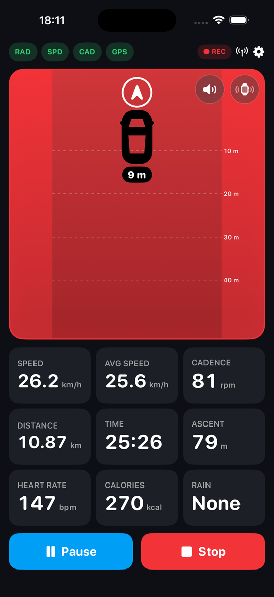
</p>

## Features

- **Rear radar lane** — vehicles behind you are plotted by distance on a clean
  perspective lane, coloured by how fast/close they are. The whole panel glows
  amber→red as a vehicle closes in; a green “Clear” shows when the road is empty.
- **Apple Watch wrist alerts** — keep your eyes up and feel what's behind you:
  - a tap the moment a *new* vehicle appears,
  - escalating taps that get faster/stronger as it closes in,
  - a distinct **double-buzz** if the radar drops out mid-ride, with a red
    **RADAR OFF** banner so the wrist never shows a misleading “Clear”.
- **Reliable radar presence** — the TR70's ~2 Hz heartbeat is used to confirm
  the radar is really there. If it's switched off or out of range, the lane
  shows **NOT CONNECTED** within a few seconds (it's a safety device — it
  shouldn't pretend to be watching when it isn't).
- **Optional new-vehicle beep** — a distinctive double-beep through the phone,
  over music and ignoring the silent switch. Toggle in Settings. The beep and the
  wrist taps fire **only while you're riding**, not when the app sits idle with
  the radar switched on.
- **Spoken vehicle call-outs** *(optional)* — a voice announces each new vehicle
  and its distance ("car behind, 40 metres"), in your units and language. Aimed
  at riders using bone-conduction headphones; works alongside or instead of the
  beep.
- **Live metrics** — current speed, average speed (moving time only), distance,
  elapsed moving time, cadence, total ascent (barometer-based when available,
  GPS-altitude fallback otherwise), live road **gradient**, plus heart rate and
  calories. Heart rate comes from a paired Apple Watch **or a standard Bluetooth
  heart-rate strap** (service 0x180D).
- **Customisable tiles & pages** — choose which metric tiles appear on the ride
  screen, and in what order. **Long-press any tile** (or the radar) to edit
  right on the ride screen: remove with the ⊖ badge, add from the dashed **+**
  tile, and **drag to rearrange** — including dragging tiles **above the
  radar** in portrait. Create **multiple pages** (swipe between them; dots
  above the controls show where you are): each page has its own tiles and can
  show or hide the radar — e.g. a radar page plus a full-screen data page. The
  app reopens on the page you last used.
  (Settings → Ride screen tiles offers the same as a list.) Options include
  speed, average/max speed, cadence, distance, time, ascent, gradient, lap time,
  heart rate, calories, a compass, and the weather tiles (rain, temperature,
  wind — the wind tile shows the speed with a direction arrow relative to your
  travel, tinted for headwind or tailwind). A
  **Show units on tiles** toggle drops the unit labels for bigger numerals, and
  **Reset to defaults** (bottom of Settings) restores the original three rows.
- **Manual laps** — tap the lap button while riding to split the ride; each lap's
  time, distance and average speed are shown in the ride summary.
- **Ride export** — share any ride (end-of-ride or from history) as a **GPX or
  TCX** file via the system share sheet — to Strava, Komoot, Ride with GPS,
  Files, and more. *(This is a manual share, not an automatic upload — see note
  below.)*
- **Crash detection → SOS** *(optional)* — a two-stage detector tuned on real
  roads: a violent impact (well above pothole/kerb spikes) is only a
  *candidate*, and the SOS fires **only if you come to a stop within 5
  seconds** of it — ride through the bump and nothing happens. On a confirmed
  crash a 20-second countdown starts; if you don't cancel it, CycleHUD opens a
  pre-filled text to your emergency contact with your location, ready to send.
  A paired Apple Watch mirrors the alert with repeating wrist buzzes — so if
  you're thrown clear while the phone stays mounted on the bike, you can tap
  **I'm OK** on the wrist to cancel on both devices, or **Call** to ring your
  emergency contact straight from the Watch.
  Set it up in **Settings → Safety**; the toggle takes effect immediately, even
  mid-ride. (iOS won't let an app send a text on its own, so the message opens
  ready for you — or a bystander — to send.)
- **Radar battery** — the TR70's battery level is shown on the radar panel, so
  you know before you set off.
- **Heart-rate warning** *(optional)* — set a max heart rate (120–220 bpm). When
  you reach it the heart-rate readout turns red and your Apple Watch
  double-buzzes, repeating every 30 s while you stay above it.
- **Weather & wind** *(optional)* — a short-term rain nowcast (next hour, Apple
  WeatherKit) shows when rain is current or coming, with its intensity, how soon
  it starts and how long it lasts, refreshing every minute. Alongside it, a
  **temperature** tile and a **wind** tile that resolves the wind against your
  GPS heading and shows it as a headwind or tailwind. Turn off in Settings.
  Requires the WeatherKit capability (see Setup).
- **Route planning** *(optional, off by default)* — plan rides on a map from a
  button on the ride screen: tap a start point, keep tapping waypoints, and the
  path snaps to **quiet roads and cycle paths** (BRouter's trekking profile over
  OpenStreetMap data). The planned line is **coloured by today's wind** — amber
  where you'd fight a headwind, green where it pushes you — so which way round
  to ride a loop answers itself. Routes loop back to the start by default, or
  turn that off to finish somewhere else. Save routes with a name and pick one to follow:
  while the road behind is clear the **radar panel becomes a live street map**
  — rotated so your direction of travel points up, the route in blue with its
  waypoints dotted along it, and the distance remaining on top — and the
  moment a vehicle appears, the radar takes the panel back. Stray from the path and the panel
  switches to **back-on-route directions**: an arrow pointing at the nearest
  point of the route, the distance to it, and a dashed link on the mini-map.
  Pick a route while away from it and CycleHUD plots a green **lead-in leg**
  along quiet roads from where you are to the start, with the arrow and
  road-distance following the leg until you join. With junctions
  on, the **Junction tile highlights the arm your route takes** in green.
  **Turn alerts** speak "left/right turn ahead" and tap your wrist as each
  bend approaches (cue distance scales with speed; toggle in Settings), and a
  **climb-profile strip** along the bottom of the map shows the whole route's
  elevation with your position marked and the gradient just ahead. Prefer the
  profile as a tile? Add the **Distance and climb row** — a full-width tile
  with distance, live gradient and ascent overlaid on the route's profile —
  and the map hands the strip over to it. Routes share as plain **GPX** —
  the format everything speaks — via the share sheet, and import from
  anywhere (Strava, Komoot, RideWithGPS, a friend's export) with the import
  button or by opening the file. No accounts involved.
- **Ghost rider** — the first time you complete a route, that run becomes the
  route's **best**; every ride after that races it live. A checkered-flag pill
  shows seconds ahead (green) or behind (red), and a purple ghost marker rides
  the map at exactly where your best run was at this point — timed from when
  each run first touches the route, so a long roll to the start doesn't skew
  the race. Beat it and the new run takes over as the ghost. Bests travel
  inside shared GPX as ordinary track timestamps, so friends can race your
  ghost — and importing any *recorded* ride GPX (a Strava activity export,
  say) turns that ride into a ghost you can race.
- **Climb card** — riding a route, each detected climb takes over the bottom
  of the map as you reach it: distance to the top, ascent left, the gradient
  of what *remains*, and the climb's own profile filling in as you gain it.
- **Insights** *(Settings → Insights)* — trends (distance and ascent by week),
  personal records (longest, most climbing, fastest average, top speed) and
  radar-powered **traffic statistics** no other app has: vehicles detected,
  detections per km, your fastest overtake, your busiest ride, and a map of
  everywhere vehicles passed you. All computed on-device from local history.
- **Upcoming junctions** *(optional, off by default)* — a **Junction** tile
  shows the next intersection ahead: a schematic of its road arms at their true
  angles (T, crossroads, roundabout…) in your frame of travel, with the distance
  counting down as you approach. Road data comes from **OpenStreetMap**'s
  Overpass API — one small fetch per kilometre or so, cached, with everything
  after that computed on-device from GPS. Because enabling it sends your
  approximate location to OSM's servers, it's strictly opt-in
  (Settings → Junctions) and disclosed in the privacy policy. Road data
  © OpenStreetMap contributors.
- **iCloud sync** — rides, routes and ghosts mirror into your own iCloud
  Drive, so history survives a lost phone and a new one picks up where you
  left off. No accounts, no CycleHUD servers — it's your personal iCloud,
  with a toggle under Settings → Data. When two devices hold the same route,
  the faster ghost wins the merge. (Needs the iCloud capability — see Setup.)
- **Apple Health workout** — tapping Stop saves a cycling workout (distance,
  duration, calories, GPS route) to Apple Health. On by default; turn *Save rides
  as workouts* off in Settings to keep rides local-only. Calories need your
  weight (asked once when workouts are on, or read from Apple Health) — without
  it, calories simply aren't shown. Requires the HealthKit capability (see Setup).
  On iOS 18+ the end-of-ride summary also asks *How hard was that ride?* — pick
  1–10 (or ignore it) and it's written to the workout as Apple's **effort
  score**, feeding Health's training-load view. Tap again to revise; on older
  iOS the prompt simply doesn't appear.
- **Ride summary & history** — every ride ends with a summary card (distance,
  time, average/peak speed, heart rate, ascent, calories) with a map of your
  route and **speed, heart-rate and elevation graphs** for the whole ride.
  **Scrub any graph or the map** — tap or drag and the same moment is marked
  everywhere: a line and value dot on every graph, a marker on the route, and a
  readout of time, speed, heart rate and elevation at that point. Rides that
  cover roads you've ridden before get a **Previous bests** card: the route is
  split where past rides joined or left it (never on sub-kilometre fragments),
  and each stretch is compared against your fastest previous time over that
  same stretch — green when this ride set the best. Past rides are listed
  under **Settings → Previous rides** and reopen the same summary.
- **Vehicles on the map** — each vehicle the radar flags during a ride is dropped
  as a pin on that ride's route map, with a count, so you can see where traffic
  came up behind you. Open the full-screen map and **tap a vehicle** to pull up
  that pass's full trace (distance, your speed and the closing speed over time).
- **"Sensors left on" reminder** — if your radar or speed/cadence sensors are
  still switched on 5 minutes after a ride ends, a notification names which ones
  so you can switch them off and save their batteries.
- **Landscape layout** *(optional)* — turn it on to fix the ride screen in
  landscape: the radar on one side (left or right — your choice) and your ride
  data and controls on the other. The HUD stays landscape regardless of how you
  hold the phone; Settings and other screens stay portrait.
- **Light, dark or Cyberpunk** — three appearances in Settings: a clean light
  theme (default), an all-black dark HUD, and a neon **Cyberpunk** theme
  matching the CycleHUD artwork — cyan→magenta backdrop with glow, gradient
  numerals, neon tile and pill rims. Pair it with the **Digital** digits option
  for a retro 7-segment LCD readout (an original display font, bundled), in any
  theme.
- **Ride control** — Start / Pause / Resume / Stop, with **auto-pause /
  auto-resume** (pauses after you're stopped < 1 km/h for 5 s, resumes ~1 s
  after you move again).
- **Speed source** — uses the wheel sensor when connected, falls back to GPS.
- **Selectable units** — asked on first launch, changeable any time.
- **Remembered sensors** — configured devices are saved and auto-reconnect on
  every launch, retrying indefinitely. The top-bar Radar/Sensor icons show live
  state: green check = connected, spinner = connecting, rotating arrow =
  reconnecting, red triangle = Bluetooth unavailable, grey = not set up.
- **Demo mode** — Settings → Demo → *Start radar demo* plays a one-time preview
  on the main screen: low (yellow), medium (orange) and high (red) vehicles, the
  beep, the **escalating wrist taps**, and a closing **radar-off** wrist alert —
  so you can feel and fine-tune every alert before a ride. It runs through once
  and stops; starting a ride also stops it.

### Getting rides into Strava

CycleHUD deliberately has **no built-in Strava login** — Strava's API requires
an OAuth account connection (and, done properly, a token-exchange server),
which would break CycleHUD's core privacy promise: no accounts, no logins, no
servers. Two paths cover it instead:

- **Automatic** — every ride is already saved to **Apple Health** as a full
  cycling workout (distance, duration, calories, GPS route). A Health→Strava
  bridge app such as **HealthFit** or **RunGap** can watch Apple Health and
  auto-upload each new workout to Strava (and Komoot, TrainingPeaks, Dropbox,
  …). Set it up once and rides appear in Strava moments after you tap Stop.
  The Strava login lives in the bridge app — CycleHUD never touches it.
- **Manual** — open any ride's summary, tap the share button, pick **GPX** or
  **TCX**, and send the file wherever you like (Strava's website, Komoot, Ride
  with GPS, Files, email) through the share sheet.

## Screenshots

<p align="center">
  
  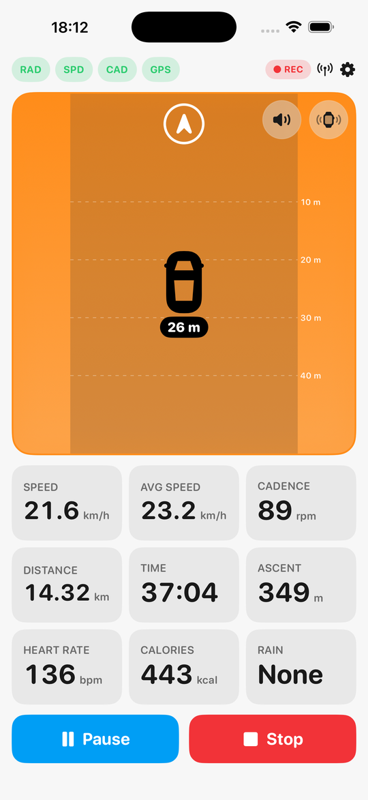
  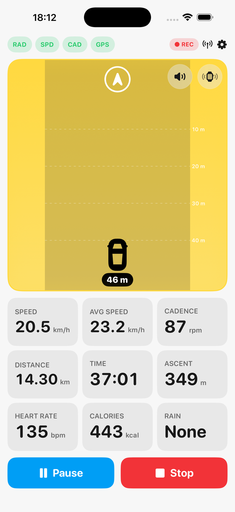
  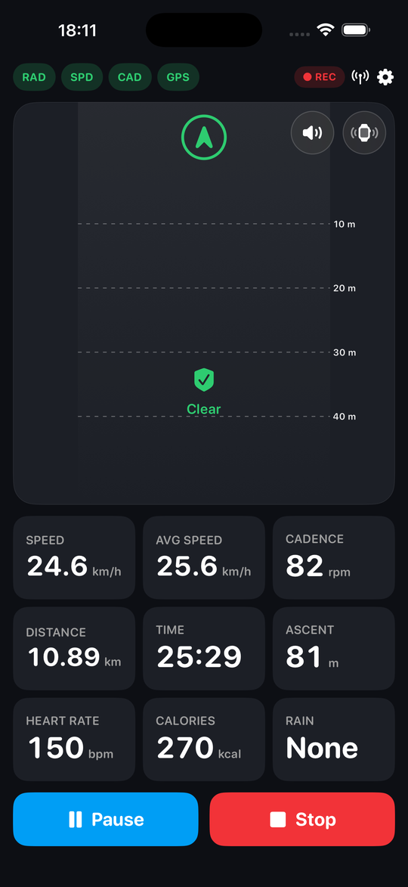
</p>
<p align="center">
  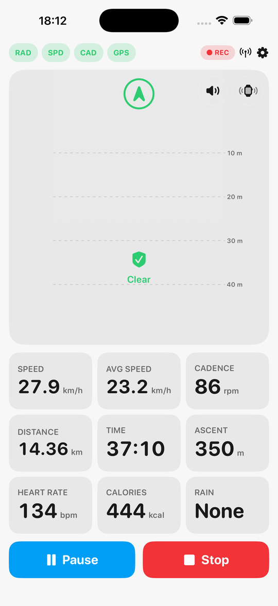
  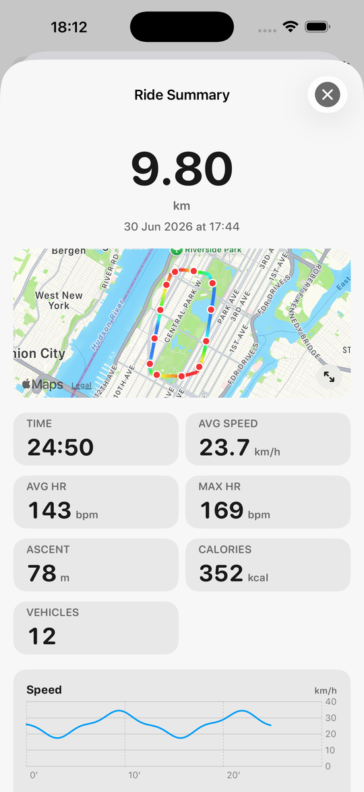
  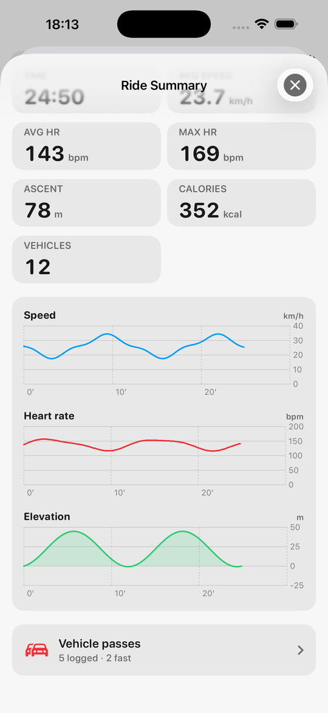
  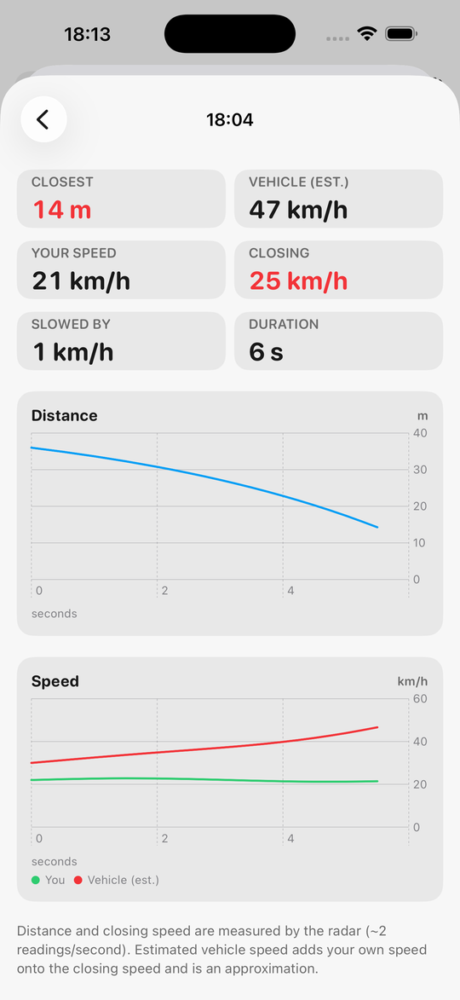
</p>
<p align="center">
  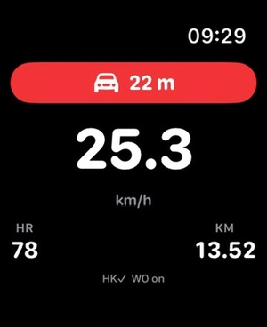
  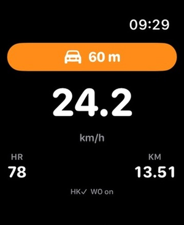
  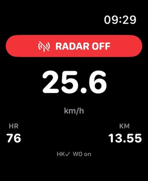
</p>

## Build & run

1. Open `CycleHUD.xcodeproj` in **Xcode 16 or newer**.
2. Select your iPhone as the run destination.
3. Set your Apple Developer team: target **CycleHUD → Signing & Capabilities →
   Team**. (Personal/free teams work for installing on your own phone.)
4. Build & run (⌘R). Approve Bluetooth and Location prompts on first launch.

> Requires a physical iPhone — Bluetooth LE and GPS don't work in the Simulator.
> Deployment target is iOS 17.

### Health & Watch setup

The Apple Watch app is central to the experience (wrist alerts + heart rate),
but it — along with saving rides to Apple Health — needs a few one-time Xcode
steps (HealthKit capability + adding the watch target) and a paid Apple
Developer account. The full walkthrough is in **[docs/SETUP.md](docs/SETUP.md)**.
The watch sources are ready in the `CyleHUDWatch Watch App/` folder; the phone
already includes the WatchConnectivity link (heart rate in; mirror display,
escalating new-car wrist taps, and the radar-off alert out). The core ride/radar
app still runs on the phone alone.

### Pairing sensors

Tap the antenna icon (top right) → **Scan** → tap your radar and your
speed/cadence sensor. They reconnect automatically on later launches. The app
labels each device as *Radar* or *Speed / Cadence* once connected.

## Sensor protocols

- **Coospo TR70 radar (primary)** — a proprietary BLE service, reverse-engineered
  from the CoospoRide app. The radar streams nothing until it's *enabled*: the
  app writes a control command to characteristic **FDB2** and resends it on a
  ~2 s keepalive, and the radar then streams frames on **FDB1**.
  - **Enable / keepalive:** write `B8 05 02 01 C0` to FDB2. Commands are
    `[opcode][len][params…][checksum]`, checksum = sum of the prior bytes & 0xFF.
  - **Data frame (FDB1):** `[0xC8][len][page][payload…][checksum]`. Page `0x24`
    is the threat page: a 14-byte target block (level at byte 3, distance in
    metres at byte 9, approach speed m/s at byte 13), all-zero when the road is
    clear. It's parsed as repeating blocks driven by the frame length, so a
    longer multi-target frame extends cleanly. Page `0x03` is a status
    heartbeat — used to confirm the radar is alive.
- **Garmin Varia–compatible radar (also supported)** — service `6A4E3200-…`,
  measurement characteristic `6A4E3203-…`. Payload is one page/counter byte then
  3 bytes per threat: `[id, distance(m), approach speed(km/h)]`.
- **Speed / cadence** — standard Bluetooth SIG CSC service `0x1816`,
  measurement characteristic `0x2A5B`.
- **Heart-rate strap** — standard Bluetooth SIG Heart Rate service `0x180D`,
  measurement characteristic `0x2A37`. Used when no Apple Watch heart rate is
  available.

New vehicles are detected by a previously-unseen threat id; the **Sensor
diagnostics** screen (Settings) shows live services, characteristics and raw
radar packets if you need to debug a sensor in the field.

### Things you may want to tune on the bike

These live in code and are easy to adjust:

- **Wheel circumference** — Settings → Speed Sensor (default 700×25c). Required
  for accurate sensor speed.
- **Threat severity colours** — `Threat.swift` (`level`): the speed/distance
  thresholds that map to yellow/orange/red.
- **Radar range shown** — `RadarView.swift` (`maxRange`, default 50 m, matching
  the TR70's real-world detection range so cars fill the lane).
- **Radar presence timeout** — `BluetoothManager.swift` (`radarDataTimeout`,
  default 4 s): how long without a heartbeat before showing NOT CONNECTED.
- **Auto-pause timing/threshold** — `RideManager.swift`.
- **Watch haptic patterns** — `WatchSessionManager.swift` (`playHaptic` for the
  new-car/proximity taps, `playEventHaptic` for the radar-off double-buzz).
- **New-vehicle beep / SOS tone** — `AudioAlerts.swift` (`makeDoubleBeepWAV`,
  `makeSOSWAV`).
- **Crash-detection sensitivity** — `CrashDetector.swift` (`impactThresholdG`,
  default 8 g) and the SOS countdown length in `SOSManager.swift`.
- **Live gradient window** — `RideManager.swift` (`updateGradient`).

> The page `0x24` distance/speed/level bytes are decoded from real traffic (a
> pedestrian is below a car radar's detection threshold, so the page only
> populates with an actual vehicle). Every capture so far is a single-target
> 18-byte frame, so the multi-target (multi-block) parsing is speculative and
> length-driven until a genuine two-car frame is captured — it's byte-for-byte
> identical for the frames seen today. `BluetoothManager.parseCoospoRadar` is the
> single place to adjust it; the Varia format is handled by `parseRadar`.

## Project layout

```
CycleHUD/
  CycleHUDApp.swift          App entry, wires managers together
  Theme.swift                Colours & fonts
  Models/                    Units, Threat, RideSummary/Lap, MetricKind, WeatherConditions
  Settings/                  AppSettings (persisted)
  Managers/
    BluetoothManager.swift   Scanning, TR70 + Varia radar, CSC, HR strap, liveness
    LocationManager.swift    GPS speed, distance, heading
    RideManager.swift        Ride state machine, auto-pause, demo, gradient, laps, Watch mirror
    WatchConnectivityManager.swift  iPhone⇄Watch link (HR in, alerts out)
    HealthKitManager.swift   Saves the cycling workout to Apple Health
    WeatherManager.swift     WeatherKit rain nowcast + temperature/wind
    RideExporter.swift       GPX / TCX export from a ride summary
    CrashDetector.swift      Core Motion impact detection
    SOSManager.swift         Crash-SOS countdown + emergency message
    RideHistory.swift        Local store of past ride summaries (JSON)
    AudioAlerts.swift        Synthesised new-vehicle beep / SOS tone / voice call-outs
    Calories.swift           HR-based calorie estimate
    AppLog.swift             On-device diagnostics log
  Views/
    RideView.swift           Main radar-first screen (portrait + landscape)
    RadarView.swift          The radar lane visualisation (+ battery badge)
    MetricTile.swift         Metric tiles
    MetricTilesView.swift    Customise which tiles show, and their order
    PairingView.swift        Sensor pairing
    SettingsView.swift       Settings
    SOSCountdownView.swift   Full-screen crash-alert countdown
    DiagnosticsView.swift    Live BLE services / radar packets
    RideSummaryView.swift    End-of-ride / history summary card + route map (+ export, laps)
    RouteMapView.swift       Full-screen route map (+ vehicle pins, Open in Maps)
    RideHistoryView.swift    Previous-rides list
    UnitsOnboardingView.swift First-launch units prompt

CyleHUDWatch Watch App/      Watch app: glanceable mirror + wrist haptics
  CycleHUDWatchApp.swift     Watch app entry
  WatchSessionManager.swift  Workout session (HR), haptic patterns, HR warning
  WatchContentView.swift     Watch face: speed/HR/distance + threat / RADAR OFF

CycleHUDComplication/        Watch complication (app logo) to launch from the face
```
