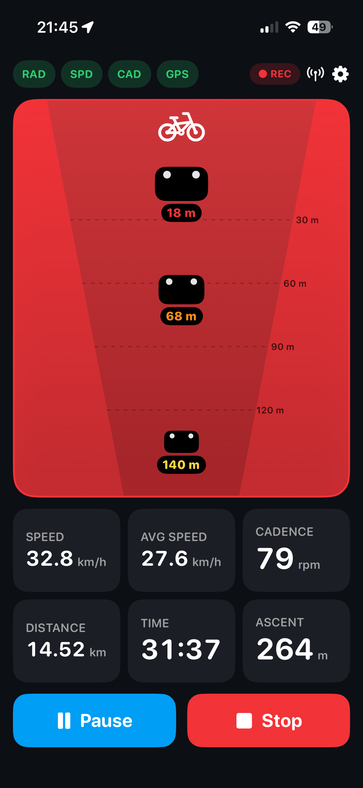

# CycleHUD

A personal, quality-of-life cycling HUD for iPhone + Apple Watch, built around
the **Coospo TR70** rear radar. The focus is a **clear, glanceable UI**,
**wrist haptics** so you can keep your eyes on the road, and a clean finish that
saves each ride as an **Apple Health workout**. Garmin Varia–compatible radars
and standard BLE speed/cadence sensors work too.

<p align="center">
  
</p>

## Features

- **Rear radar lane** — vehicles behind you are plotted by distance on a clean
  perspective lane, coloured by how fast/close they are. The whole panel glows
  amber→red as a vehicle closes in; a green “Clear” shows when the road is empty.
- **Apple Watch wrist alerts** — keep your eyes up and feel what's behind you:
  - a tap the moment a *new* vehicle appears,
  - escalating taps that get faster/stronger as it closes in,
  - a distinct **double-buzz** if the radar drops out mid-ride, with a red
    **RADAR OFF** banner so the wrist never shows a misleading “Clear”.
- **Reliable radar presence** — the TR70's ~2 Hz heartbeat is used to confirm
  the radar is really there. If it's switched off or out of range, the lane
  shows **NOT CONNECTED** within a few seconds (it's a safety device — it
  shouldn't pretend to be watching when it isn't).
- **Optional new-vehicle beep** — a distinctive double-beep through the phone,
  over music and ignoring the silent switch. Toggle in Settings. The beep and the
  wrist taps fire **only while you're riding**, not when the app sits idle with
  the radar switched on.
- **Live metrics** — current speed, average speed (moving time only), distance,
  elapsed moving time, cadence, total ascent (barometer-based when available,
  GPS-altitude fallback otherwise), plus heart rate and calories when an Apple
  Watch is paired.
- **Radar battery** — the TR70's battery level is shown on the radar panel, so
  you know before you set off.
- **Heart-rate warning** *(optional)* — set a max heart rate (120–220 bpm). When
  you reach it the heart-rate readout turns red and your Apple Watch
  double-buzzes, repeating every 30 s while you stay above it.
- **Rain nowcast** *(optional)* — a short-term forecast (next hour, Apple
  WeatherKit) shows on the ride screen when rain is current or coming, with its
  intensity, how soon it starts and how long it lasts. An optional alert
  notifies you (and your wrist) when rain is within ~15 minutes. Turn off in
  Settings. Requires the WeatherKit capability (see Setup).
- **Apple Health workout** — tapping Stop saves a cycling workout (distance,
  duration, calories, GPS route) to Apple Health. On by default; turn *Save rides
  as workouts* off in Settings to keep rides local-only. Calories need your
  weight (asked once when workouts are on, or read from Apple Health) — without
  it, calories simply aren't shown. Requires the HealthKit capability (see Setup).
- **Ride summary & history** — every ride ends with a summary card (distance,
  time, average/peak speed, heart rate, ascent, calories) over a map of your
  route, plus **speed, heart-rate and elevation graphs** for the whole ride. Past
  rides are listed under **Settings → Previous rides** and reopen the same
  summary.
- **Vehicles on the map** — each vehicle the radar flags during a ride is dropped
  as a pin on that ride's route map, with a count, so you can see where traffic
  came up behind you. Open the full-screen map and **tap a vehicle** to pull up
  that pass's full trace (distance, your speed and the closing speed over time).
- **"Sensors left on" reminder** — if your radar or speed/cadence sensors are
  still switched on 5 minutes after a ride ends, a notification names which ones
  so you can switch them off and save their batteries.
- **Landscape layout** *(optional)* — turn it on to fix the ride screen in
  landscape, radar on the left and your ride data and controls on the right. The
  HUD stays landscape regardless of how you hold the phone; Settings and other
  screens stay portrait.
- **Light or dark** — a Dark Mode toggle in Settings; the app is a clean light
  theme by default and flips to an all-black HUD when you want it.
- **Ride control** — Start / Pause / Resume / Stop, with **auto-pause /
  auto-resume** (pauses after you're stopped < 1 km/h for 5 s, resumes ~1 s
  after you move again).
- **Speed source** — uses the wheel sensor when connected, falls back to GPS.
- **Selectable units** — asked on first launch, changeable any time.
- **Remembered sensors** — configured devices are saved and auto-reconnect on
  every launch, retrying indefinitely. The top-bar Radar/Sensor icons show live
  state: green check = connected, spinner = connecting, rotating arrow =
  reconnecting, red triangle = Bluetooth unavailable, grey = not set up.
- **Demo mode** — Settings → Demo → *Start radar demo* plays a one-time preview
  on the main screen: low (yellow), medium (orange) and high (red) vehicles, the
  beep, the **escalating wrist taps**, and a closing **radar-off** wrist alert —
  so you can feel and fine-tune every alert before a ride. It runs through once
  and stops; starting a ride also stops it.

## Build & run

1. Open `CycleHUD.xcodeproj` in **Xcode 16 or newer**.
2. Select your iPhone as the run destination.
3. Set your Apple Developer team: target **CycleHUD → Signing & Capabilities →
   Team**. (Personal/free teams work for installing on your own phone.)
4. Build & run (⌘R). Approve Bluetooth and Location prompts on first launch.

> Requires a physical iPhone — Bluetooth LE and GPS don't work in the Simulator.
> Deployment target is iOS 17.

### Health & Watch setup

The Apple Watch app is central to the experience (wrist alerts + heart rate),
but it — along with saving rides to Apple Health — needs a few one-time Xcode
steps (HealthKit capability + adding the watch target) and a paid Apple
Developer account. The full walkthrough is in **[docs/SETUP.md](docs/SETUP.md)**.
The watch sources are ready in the `CyleHUDWatch Watch App/` folder; the phone
already includes the WatchConnectivity link (heart rate in; mirror display,
escalating new-car wrist taps, and the radar-off alert out). The core ride/radar
app still runs on the phone alone.

### Pairing sensors

Tap the antenna icon (top right) → **Scan** → tap your radar and your
speed/cadence sensor. They reconnect automatically on later launches. The app
labels each device as *Radar* or *Speed / Cadence* once connected.

## Sensor protocols

- **Coospo TR70 radar (primary)** — a proprietary BLE service, reverse-engineered
  from the CoospoRide app. The radar streams nothing until it's *enabled*: the
  app writes a control command to characteristic **FDB2** and resends it on a
  ~2 s keepalive, and the radar then streams frames on **FDB1**.
  - **Enable / keepalive:** write `B8 05 02 01 C0` to FDB2. Commands are
    `[opcode][len][params…][checksum]`, checksum = sum of the prior bytes & 0xFF.
  - **Data frame (FDB1):** `[0xC8][len][page][payload…][checksum]`. Page `0x24`
    is the threat page: a 14-byte target block (level at byte 3, distance in
    metres at byte 9, approach speed m/s at byte 13), all-zero when the road is
    clear. It's parsed as repeating blocks driven by the frame length, so a
    longer multi-target frame extends cleanly. Page `0x03` is a status
    heartbeat — used to confirm the radar is alive.
- **Garmin Varia–compatible radar (also supported)** — service `6A4E3200-…`,
  measurement characteristic `6A4E3203-…`. Payload is one page/counter byte then
  3 bytes per threat: `[id, distance(m), approach speed(km/h)]`.
- **Speed / cadence** — standard Bluetooth SIG CSC service `0x1816`,
  measurement characteristic `0x2A5B`.

New vehicles are detected by a previously-unseen threat id; the **Sensor
diagnostics** screen (Settings) shows live services, characteristics and raw
radar packets if you need to debug a sensor in the field.

### Things you may want to tune on the bike

These live in code and are easy to adjust:

- **Wheel circumference** — Settings → Speed Sensor (default 700×25c). Required
  for accurate sensor speed.
- **Threat severity colours** — `Threat.swift` (`level`): the speed/distance
  thresholds that map to yellow/orange/red.
- **Radar range shown** — `RadarView.swift` (`maxRange`, default 50 m, matching
  the TR70's real-world detection range so cars fill the lane).
- **Radar presence timeout** — `BluetoothManager.swift` (`radarDataTimeout`,
  default 4 s): how long without a heartbeat before showing NOT CONNECTED.
- **Auto-pause timing/threshold** — `RideManager.swift`.
- **Watch haptic patterns** — `WatchSessionManager.swift` (`playHaptic` for the
  new-car/proximity taps, `playEventHaptic` for the radar-off double-buzz).
- **New-vehicle beep** — `AudioAlerts.swift` (`makeDoubleBeepWAV`).

> The page `0x24` distance/speed/level bytes are decoded from real traffic (a
> pedestrian is below a car radar's detection threshold, so the page only
> populates with an actual vehicle). Every capture so far is a single-target
> 18-byte frame, so the multi-target (multi-block) parsing is speculative and
> length-driven until a genuine two-car frame is captured — it's byte-for-byte
> identical for the frames seen today. `BluetoothManager.parseCoospoRadar` is the
> single place to adjust it; the Varia format is handled by `parseRadar`.

## Project layout

```
CycleHUD/
  CycleHUDApp.swift          App entry, wires managers together
  Theme.swift                Colours & fonts
  Models/                    Units, Threat, RideSummary
  Settings/                  AppSettings (persisted)
  Managers/
    BluetoothManager.swift   Scanning, TR70 + Varia radar, CSC, radar liveness
    LocationManager.swift    GPS speed & distance fixes
    RideManager.swift        Ride state machine, auto-pause, demo, Watch mirror
    WatchConnectivityManager.swift  iPhone⇄Watch link (HR in, alerts out)
    HealthKitManager.swift   Saves the cycling workout to Apple Health
    RideHistory.swift        Local store of past ride summaries (JSON)
    AudioAlerts.swift        Synthesised new-vehicle beep
    Calories.swift           HR-based calorie estimate
    AppLog.swift             On-device diagnostics log
  Views/
    RideView.swift           Main radar-first screen (portrait + landscape)
    RadarView.swift          The radar lane visualisation (+ battery badge)
    MetricTile.swift         Metric tiles
    PairingView.swift        Sensor pairing
    SettingsView.swift       Settings
    DiagnosticsView.swift    Live BLE services / radar packets
    RideSummaryView.swift    End-of-ride / history summary card + route map
    RouteMapView.swift       Full-screen route map (+ vehicle pins, Open in Maps)
    RideHistoryView.swift    Previous-rides list
    UnitsOnboardingView.swift First-launch units prompt

CyleHUDWatch Watch App/      Watch app: glanceable mirror + wrist haptics
  CycleHUDWatchApp.swift     Watch app entry
  WatchSessionManager.swift  Workout session (HR), haptic patterns, HR warning
  WatchContentView.swift     Watch face: speed/HR/distance + threat / RADAR OFF

CycleHUDComplication/        Watch complication (app logo) to launch from the face
```
